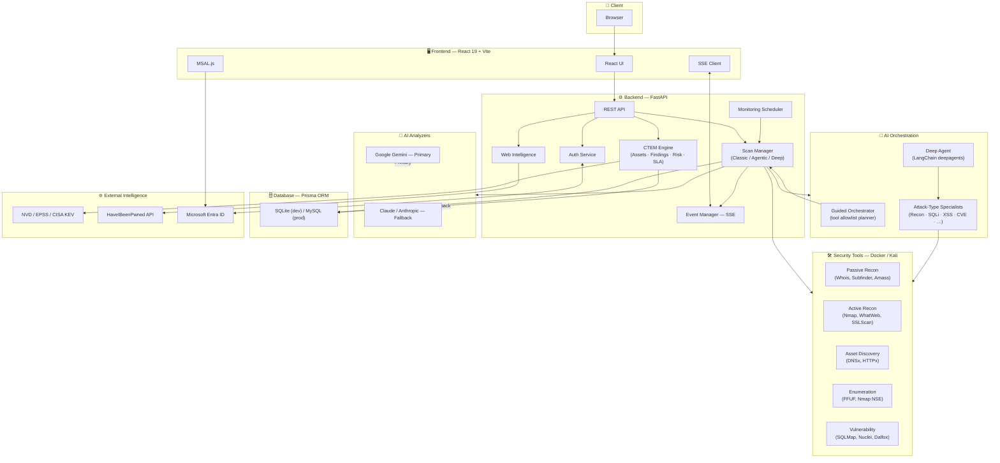

# Scout — CTEM & AI-Driven Penetration Testing Platform

**Scout** is a comprehensive Continuous Threat Exposure Management (CTEM) and automated penetration-testing platform. It orchestrates 15+ industry-standard security tools, builds a persistent attack-surface inventory, enriches findings with live CVE intelligence, prioritizes them into risk-scored "fix-by" exposures, and drives remediation — all wrapped in a modern real-time web UI. Three scan modes span the automation spectrum: a deterministic **Classic** pipeline, an **AI-Guided** agent that decides which tools to run, and a **Deep Agent** mode where a Claude-powered orchestrator delegates to attack-type specialist sub-agents.


---

## 🏗️ Architecture



---

## 🚀 Features

### 🎯 Continuous Threat Exposure Management (CTEM)

Scout goes beyond one-off scans — every scan feeds a living exposure-management loop:

- **Attack Surface Inventory:** A persistent, deduplicated inventory of assets (domains, subdomains, IPs, URLs) extracted from discovery output. Each sighting is recorded as an observation, so the surface can be **diffed across scans** — new assets are flagged, disappeared assets flip to inactive, and asset drift raises a live event.
- **Exposures & Prioritization:** Findings are ranked 0–100 by a transparent **risk engine** that blends AI severity, CVE intelligence (CVSS, EPSS, CISA KEV), and asset business-criticality, then maps each to an **SLA "fix-by" date**. A Known-Exploited (KEV) critical automatically gets the tightest deadline.
- **CVE Enrichment:** Cache-first enrichment against three free public sources — **NVD** (CVSS base score/vector), **FIRST EPSS** (exploitation probability), and the **CISA KEV** catalog (known-exploited flag). Degrades gracefully when offline; can auto-match CVEs from detected software + version.
- **Remediation Tracking:** Auto-generated remediation tickets for Critical/High findings with due dates, triage states, and status workflow (Open → In Progress → Done), including SLA-breach tracking.
- **Continuous Monitoring:** A built-in asyncio scheduler auto-launches recurring scans on hourly/daily/weekly/monthly/cron cadences and refreshes the KEV/EPSS intelligence cache daily — no external scheduler dependency.

### 🔍 Three Scan Modes

- **Classic:** Deterministic, developer-authored pipeline covering Passive Recon, Asset Discovery, Active Recon, Enumeration, and Vulnerability Analysis — every selected tool runs, in order.
- **AI-Guided (Agentic):** A constrained planner decides, before each phase, which of the phase's **allowlisted** tools to run and tunes whitelisted parameters based on what's been discovered so far. It records its reasoning (selected/skipped tools, confidence, model used) into a per-phase **agent timeline**. Hard guardrails: no free-form commands, per-tool parameter whitelists, budget caps, and a deterministic fallback that runs all tools if the model fails.
- **Deep Agent (Multi-Specialist):** A **LangChain `deepagents`** orchestrator (Claude Opus) plans an engagement and delegates to attack-type **specialist sub-agents** — Recon, SQLi, XSS, CVE/Nuclei, Content Discovery, Web-Logic — each owning its own tools. Every command still flows through a scope/safety gate. Requires an authorized engagement; produces a dedicated multi-agent report.

### 🛡️ Security Tool Orchestration

- **Granular Tool Execution:** Individual tools are orchestrated directly (no monolithic scripts), giving real-time per-tool feedback, exact commands, exit codes, and fine-grained status.
- **15+ Integrated Tools:**
  - **Passive Recon:** Whois, NSLookup, Subfinder, Amass (Passive), Assetfinder, Web Scraper Recon.
  - **Active Recon:** Nmap (Top 1000), WhatWeb, WafW00f, SSLScan/HTTPx.
  - **Asset Discovery:** Subfinder, DNS Resolver (DNSx), Alive Web Hosts.
  - **Enumeration:** FFUF, Nmap NSE.
  - **Vulnerability Analysis:** SQLMap, Dalfox, Nuclei.
- **Robust Pipeline:** Automatic retries (up to 3×), configurable timeouts, output file-piping between tools (e.g. `subs.txt` → `dnsx`), per-scan temp isolation, connection heartbeats, ANSI log sanitization, and human-readable exit-code mapping.
- **Flexible Execution:** Runs tools locally in a Docker container or over SSH against a remote Kali Linux host.

### 🔐 Authorization & Governance

- **Engagement Registry:** Deep scans refuse to start unless an **active, unexpired engagement** authorizes the target — recording in-scope hosts/domains/CIDRs, exclusions, approver, and expiry. **Fail-closed** scope matching (exact / subdomain / wildcard / CIDR) is shared across all modes.
- **AI Tools Registry:** A per-user catalog of tools the AI-Guided agent may author commands from — each with a description, usage notes, and an enforced executable binary.
- **Hard Safety Boundaries:** Detection/assessment oriented only — no destructive actions, DoS flooding, malware, or social engineering, enforced in agent prompts and the command gate.

### 🌐 Web Intelligence

- **Domain Intelligence Module** (no full scan needed): DNS records (A, AAAA, MX, NS, TXT, CNAME, SOA), DNSSEC status, email security (SPF, DMARC, DKIM), WHOIS, IP geolocation & traceroute, IP blacklist/reputation checks, OSINT collection, and TLS/SSL certificate + security-header analysis.
- **Scan History:** Persistent search history with easy re-analysis.

### 🔒 Email Breach Checker

- **HaveIBeenPwned Integration:** Check whether email addresses appear in known breaches, with breach names, dates, and exposed data types.

### 🧠 AI-Powered Analysis

- **Dual Analyzer Support:** **Google Gemini** (primary) with **Claude / Anthropic** as an automatic fallback — same interface for phase analysis and agent decisions.
- **Smart Summaries:** Converts raw terminal logs into human-readable executive summaries.
- **Remediation Advice & Severity Classification:** AI-generated mitigation strategies and automatic categorization (Critical, High, Medium, Low, Info).

### 💻 Modern User Interface

- **Real-Time Updates (SSE):** App-wide live updates — dashboard running-scan counters and stats, auto-refreshing history, live scan logs with phase grouping and progress bars, and the agent decision timeline.
- **Immersive Landing Page:** Interactive 3D visuals via **React Three Fiber / Three.js** and smooth-scroll (Lenis).
- **Interactive Reports:** Filter findings by severity, inspect raw logs and the exact commands executed.
- **PDF Reporting:** One-click professional reports — a classic report and a dedicated **Deep Agent report** (authorization page, per-specialist coverage matrix, delegation timeline, findings grouped by specialist).
- **Theming & Responsive:** Full light/dark mode across all pages; works on desktop and tablet.

### 👥 User Management & Authentication

- **Microsoft SSO** with Azure AD / Entra ID, plus **local email/password** auth with password-strength validation.
- **Admin Dashboard:** View/manage users, activate/deactivate accounts, grant/revoke admin.
- **User Profiles:** Personal profile management with organization details.

---

## 🛠️ Technology Stack

### Frontend

| Technology                                                                     | Purpose            |
| ------------------------------------------------------------------------------ | ------------------ |
| [React 19](https://react.dev/) + [TypeScript](https://www.typescriptlang.org/) | UI Framework       |
| [Vite](https://vitejs.dev/)                                                    | Build Tool         |
| [Tailwind CSS](https://tailwindcss.com/)                                       | Styling            |
| [React Router 7](https://reactrouter.com/)                                     | Routing            |
| [React Three Fiber](https://r3f.docs.pmnd.rs/) + [Three.js](https://threejs.org/) | 3D Landing Visuals |
| [Framer Motion](https://www.framer.com/motion/) + [Lenis](https://lenis.darkroom.engineering/) | Animation & Scroll |
| [Recharts](https://recharts.org/)                                              | Data Visualization |
| [MSAL.js](https://github.com/AzureAD/microsoft-authentication-library-for-js)  | Microsoft SSO      |
| [Lucide React](https://lucide.dev/)                                            | Icons              |
| Context API                                                                    | State Management   |

### Backend

| Technology                                        | Purpose                     |
| ------------------------------------------------- | --------------------------- |
| [FastAPI](https://fastapi.tiangolo.com/) (Python) | API Framework               |
| [Prisma](https://www.prisma.io/) (Python client)  | ORM                         |
| SQLite (dev) / MySQL (prod)                        | Database                    |
| `asyncio` + `asyncssh`                            | Concurrent Task Execution   |
| Google Generative AI (Gemini)                     | Primary AI Analyzer         |
| [Anthropic](https://docs.anthropic.com/) (Claude) | Fallback AI Analyzer        |
| [LangChain `deepagents`](https://github.com/langchain-ai/deepagents) | Deep Agent Orchestration    |
| NVD / FIRST EPSS / CISA KEV                        | CVE Threat Intelligence     |
| ReportLab                                         | PDF Report Generation       |
| PyJWT / Passlib                                   | Auth & Password Hashing     |

### Infrastructure

| Technology                     | Purpose                |
| ------------------------------ | ---------------------- |
| Docker / Docker Compose        | Containerization       |
| Azure Container Apps (ACA)     | Cloud Deployment       |
| Azure Container Registry (ACR) | Image Registry         |
| Azure Files                    | Persistent Storage     |
| GitHub Actions                 | CI/CD Pipeline         |
| Nginx                          | Frontend Reverse Proxy |

---

## 📦 Deployment

Scout is fully containerized and supports local dev, a bundled MySQL stack, and cloud production.

### 🐳 Local Development (SQLite — no DB server)

The active schema (`backend/prisma/schema.prisma`) targets **SQLite**, so no database server is needed.

```bash
# Backend (from backend/)
python -m venv .venv && .venv\Scripts\activate
pip install -r requirements.txt
prisma generate
prisma db push                 # creates backend/prisma/dev.db
uvicorn app.main:app --reload --port 8000

# Frontend (from frontend/)
npm install
npm run dev
```

### 🐳 Docker Compose (bundled MySQL)

```bash
docker compose -f docker-compose.mysql.yml up --build
```

The production MySQL variant is preserved as `backend/prisma/schema.mysql.prisma` and kept in sync with the SQLite schema.

### ☁️ Azure Container Apps (Production)

A complete CI/CD pipeline via **GitHub Actions** builds the frontend and backend images, pushes them to Azure Container Registry, deploys to Azure Container Apps, and manages secrets (JWT, API keys, database URL).

👉 **[Read the Full Deployment Guide](DOCKER.md)** · **[CTEM End-to-End Walkthrough](CTEM_WALKTHROUGH.md)**

---

## 📂 Project Structure

```
Scout/
├── backend/                         # FastAPI backend application
│   ├── app/
│   │   ├── api/                     # Routers: auth, scans, ai_scans, ctem, engagements,
│   │   │                            #          schedules, aitools, webintel, breaches, admin…
│   │   ├── core/                    # Config, security, tool_config (tool/pipeline definitions)
│   │   ├── models/                  # Pydantic models (scan, ctem, engagement, aitool…)
│   │   └── services/
│   │       ├── scan_manager.py      # Core scanning engine (classic / agentic / deep)
│   │       ├── agent_orchestrator.py# AI-Guided allowlist planner + safety gate
│   │       ├── deep_agent/          # LangChain deepagents: orchestrator, specialists, tools, authz
│   │       ├── asset_manager.py     # Attack-surface inventory + drift detection
│   │       ├── cve_enricher.py      # NVD / EPSS / CISA KEV enrichment
│   │       ├── risk_engine.py       # Risk scoring + SLA "fix-by" dates
│   │       ├── scheduler.py         # Continuous-monitoring loop
│   │       ├── gemini_analyzer.py   # Primary AI analyzer
│   │       ├── claude_analyzer.py   # Fallback AI analyzer
│   │       └── report_generator*.py # Classic + Deep Agent PDF reports
│   └── prisma/                      # schema.prisma (SQLite) + schema.mysql.prisma (prod)
├── frontend/                        # React 19 frontend
│   └── src/
│       ├── pages/                   # Dashboard, AttackSurface, Exposures, Remediation,
│       │                            # Schedules, Engagements, DeepScanView, AiScanView…
│       ├── components/              # Layout, Sidebar, WebIntelligence, landing/ (3D)
│       └── context/                # SSE, Theme, Auth contexts
├── .github/workflows/              # GitHub Actions CI/CD
├── docker-compose.yml              # Local stack
├── docker-compose.mysql.yml        # Bundled MySQL stack
└── Dockerfile.{backend,frontend}   # Container definitions
```

---

## ⚙️ Configuration

### Environment Variables (Backend)

```env
# Database — SQLite (dev) or MySQL (prod)
DATABASE_URL=file:./dev.db
JWT_SECRET=your-secret-key

# Execution: "local" (container) or "ssh" (remote Kali)
EXECUTION_MODE=local

# AI Analyzers — Gemini primary, Claude fallback
GEMINI_API_KEY=your-gemini-api-key
ANTHROPIC_API_KEY=your-anthropic-key
ANTHROPIC_MODEL=claude-opus-4-8

# Deep Agent mode
DEEP_AGENT_MODEL=            # blank => falls back to ANTHROPIC_MODEL
DEEP_AGENT_MAX_STEPS=24
DEEP_AGENT_MAX_SECONDS=3600

# CVE enrichment (NVD works keyless; a key raises rate limits)
NVD_API_KEY=
CVE_AUTO_MATCH=true

# Microsoft SSO
ENABLE_MICROSOFT_SSO=true
MICROSOFT_CLIENT_ID=your-azure-client-id
```

### Environment Variables (Frontend, build-time)

```env
VITE_MICROSOFT_CLIENT_ID=your-azure-client-id
VITE_MICROSOFT_AUTHORITY=https://login.microsoftonline.com/common
```

---

## 🔒 Security Note

> [!CAUTION]
> This tool is intended for **authorized security testing and educational purposes only**. Always obtain explicit permission before scanning any target — Deep Agent mode enforces this via the engagement registry. The developers are not responsible for misuse or illegal activities.

---

## 📄 License

This project is proprietary software owned by Sarral.io.

---

## 🤝 Contributing

Contributions are welcome! Please fork the repository and submit a pull request.
